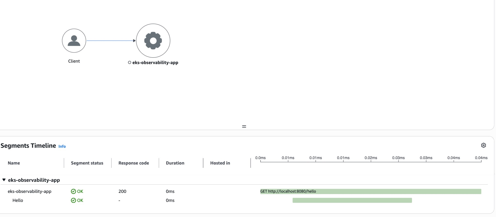
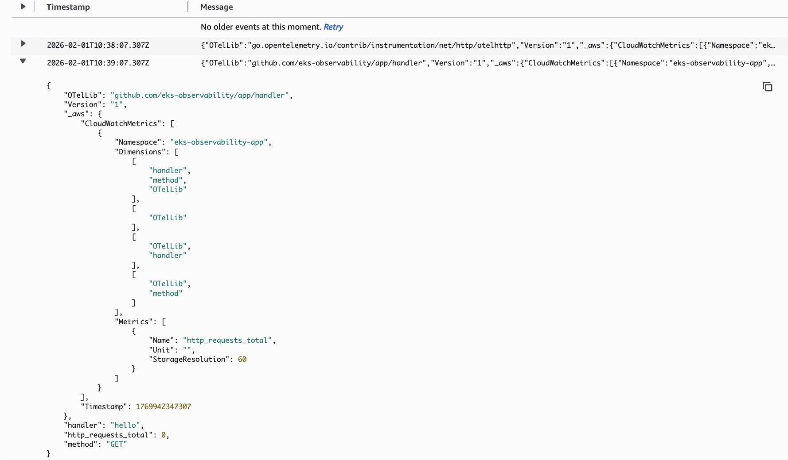

# EKS Observability with Go

Learn observability (logs, metrics, tracing) on AWS EKS using a Go app with OpenTelemetry and ADOT.

## Overview

- **Go app** sends traces, metrics, and logs via **OTLP (gRPC)** to **ADOT Collector** in EKS.
- **ADOT Collector** forwards to **CloudWatch**, **X-Ray**, and optionally **Amazon Managed Prometheus (AMP)**.
- Stack: **OpenTelemetry (OTel)** + **AWS Distro for OpenTelemetry (ADOT)**.

- **Terminology:** [docs/terminology.md](docs/terminology.md)
- **OTEL + ADOT architecture:** [docs/architecture.md](docs/architecture.md)

---

## Step 1: Prerequisites

Before you run anything, check that you have:

| Tool | How to check |
|------|----------------|
| Go 1.19+ | Run `go version` in a terminal. |
| Docker | Run `docker --version`. (Optional for Step 2; needed later for Collector and EKS.) |

You do **not** need an EKS cluster or AWS account to run the app locally (Step 2).

---

## Step 2: Run the app locally

Do these in order.

**2.1 Open a terminal and go to the app folder.**

```bash
cd /path/to/eks-observability/app
```

(Replace `/path/to/eks-observability` with your actual path.)

**2.2 Download dependencies.**

```bash
go mod tidy
```

**2.3 Start the app.**

```bash
go run ./cmd/server
```

You should see something like: `listening on :8080`.

**2.4 In another terminal, call the app.**

```bash
curl http://localhost:8080/health
curl http://localhost:8080/hello
```

You should get JSON back. The app is running. It will try to send traces/metrics to `localhost:4317`; if nothing is listening there, that is fine for this step.

**2.5 Stop the app.**

In the terminal where the app is running, press `Ctrl+C`.

---

## Step 3: See your data (optional, local)

To see traces and metrics, run the ADOT Collector in Docker. It will listen for OTLP on port 4317 and send data to AWS X-Ray and CloudWatch.

**3.1 Prerequisite: AWS credentials.**

You must have AWS credentials configured (e.g. [AWS CLI quickstart](https://docs.aws.amazon.com/cli/latest/userguide/cli-configure-quickstart.html)). The Collector will use them to send data to X-Ray and CloudWatch.

**3.2 Get the Collector config file.**

The official example config is in the `aws-otel-collector` repo. Clone it once:

```bash
git clone https://github.com/aws-observability/aws-otel-collector.git
cd aws-otel-collector
```

You will run Docker from inside this folder so the config path works.

**3.3 Run the ADOT Collector in Docker.**

From inside `aws-otel-collector`, run (replace `ap-southeast-1` with your AWS region if needed):

```bash
docker run --rm -p 4317:4317 -p 55680:55680 -p 8889:8888 \
  -e AWS_REGION=ap-southeast-1 \
  -e AWS_PROFILE=default \
  -v ~/.aws:/home/aoc/.aws \
  -v "${PWD}/examples/docker/config-test.yaml":/otel-local-config.yaml \
  --name awscollector public.ecr.aws/aws-observability/aws-otel-collector:latest \
  --config otel-local-config.yaml
```

- Port **4317** is OTLP gRPC (your app will send here).
- `~/.aws:/home/aoc/.aws` mounts your AWS config into the container; `aoc` is the default user inside the ADOT Collector image (you do not change it).
- If you use a different AWS profile, change `AWS_PROFILE=default`.
- To use access keys instead of a profile, see the [ADOT Collector Docker demo](https://github.com/aws-observability/aws-otel-collector/blob/main/docs/developers/docker-demo.md).

Leave this terminal open; the Collector runs in the foreground.

**3.4 Start the app** (in a second terminal).

From the `app` folder run (use insecure so the app uses plain gRPC to the local Collector):

```bash
OTEL_EXPORTER_OTLP_INSECURE=true go run ./cmd/server
```

The app sends OTLP to `localhost:4317`. Without `OTEL_EXPORTER_OTLP_INSECURE=true` the app uses TLS and the Collector will log "bogus greeting" errors.

**3.5 Send traffic.**

```bash
curl http://localhost:8080/health
curl http://localhost:8080/hello
```

**3.6 View data in AWS.**

- **X-Ray:** AWS Console → X-Ray → Traces (or Service map). Example trace for a `GET /hello` request:

  

- **CloudWatch:** AWS Console → CloudWatch → Logs and/or Metrics (depending on the example config). Example EMF log entries for `eks-observability-app` metrics (e.g. `http_requests_total`):

  

**3.7 Stop the Collector.**

In the terminal where the Collector is running, press `Ctrl+C`.

---

## Step 4: Run in EKS

Do this when you have an EKS cluster and want to run the app and Collector there.

**4.1 Create or use an EKS cluster.**

Use the AWS console, `eksctl`, or Terraform. You need `kubectl` and cluster access.

**4.2 Install the ADOT EKS Add-on.**

Follow [ADOT EKS Add-on](https://aws-otel.github.io/docs/getting-started/adot-eks-add-on/). Configure the Collector so it accepts OTLP and exports to X-Ray and CloudWatch (and AMP if you use it).

**4.3 Build and push the app image.**

From the repo root:

```bash
cd app
docker build -t YOUR_ECR_OR_REGISTRY/eks-observability-app:latest .
docker push YOUR_ECR_OR_REGISTRY/eks-observability-app:latest
```

Replace `YOUR_ECR_OR_REGISTRY` with your ECR repo URL or other registry.

**4.4 Create the namespace.**

```bash
kubectl apply -f k8s/namespace.yaml
```

**4.5 Update the app Deployment image.**

Edit `k8s/app/deployment.yaml`: set `image` to your pushed image (e.g. `YOUR_ECR_OR_REGISTRY/eks-observability-app:latest`). Set `OTEL_EXPORTER_OTLP_ENDPOINT` to your Collector service (e.g. `http://adot-collector.observability.svc.cluster.local:4317`).

**4.6 Deploy the app.**

```bash
kubectl apply -f k8s/app/
```

**4.7 Check the app.**

```bash
kubectl get pods -n observability
kubectl get svc -n observability
```

Use a port-forward or LoadBalancer/Ingress to call the app, then check X-Ray and CloudWatch for traces and metrics.

---

## Step 5: Production notes

When you run for real:

- Use **TLS** for OTLP (do not use `WithInsecure`).
- Use **sampling** (e.g. `TraceIDRatioBased` or X-Ray remote sampler) instead of 100%.
- Add **SLO/alerting** from metrics in CloudWatch or AMP.
- Call telemetry shutdown (TracerProvider, MeterProvider, LoggerProvider) on app exit with a timeout (already done in this app).

---

## Project layout

```
eks-observability/
├── README.md
├── docs/
│   ├── terminology.md
│   └── architecture.md
├── app/                 # Go app (OTel + HTTP server)
│   ├── cmd/server/
│   ├── internal/telemetry, handler
│   └── Dockerfile
└── k8s/                 # Namespace, ADOT ref, app Deployment/Service
```
