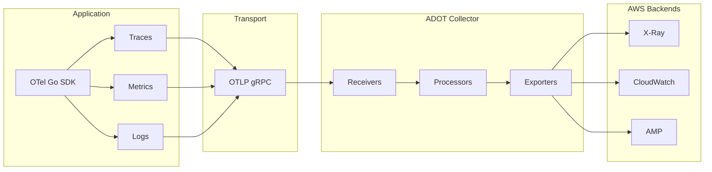

# OTEL + ADOT Architecture

How **OpenTelemetry (OTel)** and **AWS Distro for OpenTelemetry (ADOT)** fit together in this project.

## Overview

| Layer | Technology | Role |
|-------|------------|------|
| **App** | OTel Go SDK | Instrumentation: creates traces, metrics, logs and sends them over OTLP. |
| **Transport** | OTLP (gRPC) | Protocol between app and Collector. |
| **Collector** | ADOT Collector | Receives OTLP, processes/batches, exports to AWS backends. |
| **Backends** | X-Ray, CloudWatch, AMP | Where telemetry is stored and viewed. |

- **OTel** = open standard and SDK (in your app). You use the same API/SDK regardless of backend.
- **ADOT** = AWS build of the OpenTelemetry Collector and EKS integration. It speaks OTLP and exports to X-Ray, CloudWatch, AMP.

## Architecture diagram

## How it fits together

1. **Application** uses the **OTel Go SDK** (TracerProvider, MeterProvider, LoggerProvider). It does not know about X-Ray or CloudWatch; it only exports OTLP to an endpoint.

2. **ADOT Collector** runs as a separate process (e.g. in EKS via the ADOT Add-on). It exposes an **OTLP receiver** (gRPC on 4317). The app sets `OTEL_EXPORTER_OTLP_ENDPOINT` to the Collector address.

3. **Collector pipeline:** Receivers accept OTLP → Processors (e.g. batch) → Exporters send to X-Ray, CloudWatch, AMP. You configure this in the Collector config (see `k8s/adot/collector-config.yaml`).

4. **Backends:** You view traces in the X-Ray console, metrics and logs in CloudWatch, and Prometheus metrics in AMP (if configured).

## Why OTel + ADOT

- **Single instrumentation:** One SDK (OTel) for traces, metrics, and logs. No vendor-specific SDKs in app code.
- **Portable:** Same app can send to a different Collector or backend later by changing config.
- **AWS-supported:** ADOT Collector is supported by AWS, works with the EKS Add-on, and exports to X-Ray, CloudWatch, AMP with the right IAM and config.

See [terminology](terminology.md) for main components and the Collector.
